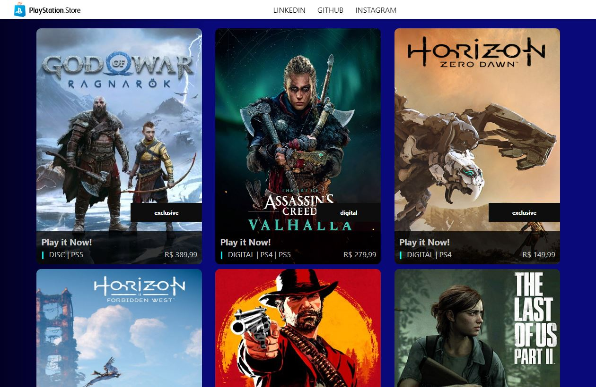

# Reprodução da Interface da PSN Store no Angular

Bem-vindo ao projeto de reprodução da interface da PlayStation Network (PSN) Store em Angular. Este projeto foi desenvolvido para demonstrar as habilidades de desenvolvimento web e o uso do Angular para criar uma interface semelhante à da PSN Store.

## Layout PSN Store Desktop

## Funcionalidades Principais

- **Estrutura de Componentes**: O projeto é desenvolvido em Angular e utiliza uma estrutura de componentes e subcomponentes para organização e reutilização de código.

- **Informações Dinâmicas**: As partes principais do projeto, como a listagem de produtos, podem ser atualizadas manualmente ou através da integração com uma API externa. Oferencendo flexibilidade na gestão dos conteúdos, permitindo ajustes conforme necessário.

- **Listagem de Produtos**: Exibe uma lista de jogos e produtos da PSN Store.

- **Detalhes do Produto:**: Permite visualizar informações exclusividade ou tipo de mídia e preço.

Obrigado pelo interesse! Este foi um projeto de estudo em Angular. Até a próxima e continue acompanhando!
